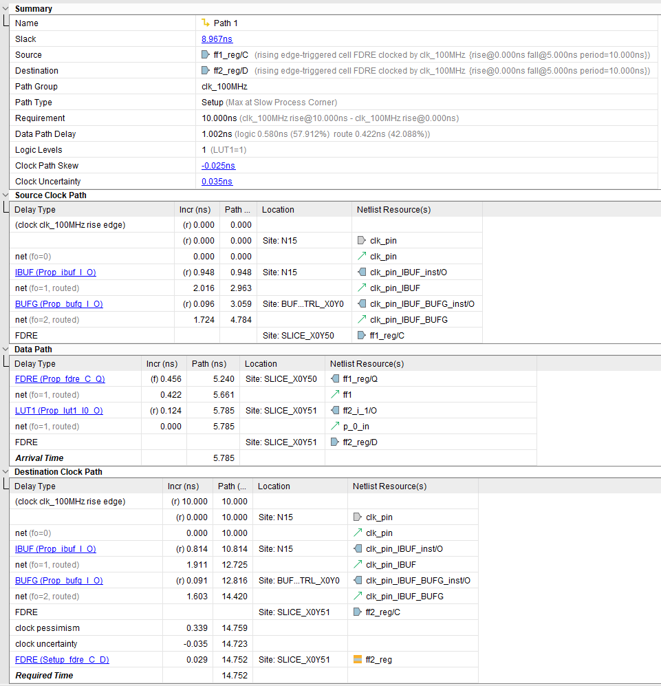
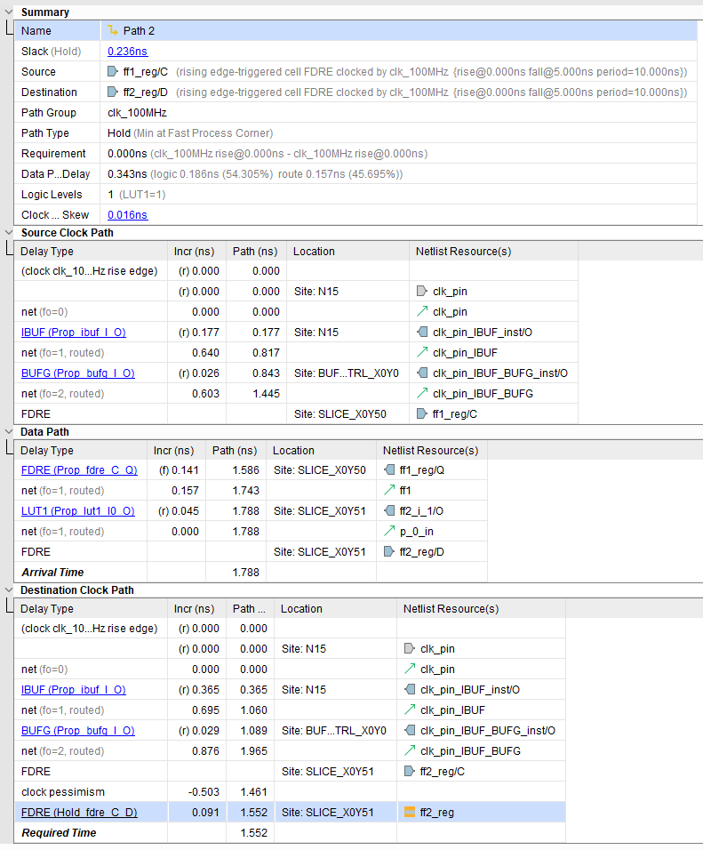

# Схемотехника
## Практическая работа №2
Выполнил: ИВБО-01-21, Лузгин М.А.

### 1. Анализ ограничений по *Setup*

Рассчёт ведётся по следующим формулам:

$$T_{dr\_min} = T_{dcd\_min} + T_{clk} - T_{su}$$

$$T_{da\_max} = T_{scd\_max} + T_{co\_max} + T_{dpd\_max}$$

$$Slack = T_{dr\_min} - T_{da\_max}$$

За основу возьмём данные, предоставляемые САПР Vivado.

$$T_{scd\_max} = 4.784\text{ ns}$$

$$T_{co\_max} = 0.456\text{ ns}$$

$$T_{dpd\_max} = 0.422+0.124 = 0.546\text{ ns}$$

$$T_{dcd\_min} = 4.419\text{ ns}$$

$$T_{clk} = 10\text{ ns}$$

$$T_{su} = -0.029\text{ ns}$$

Получим:

$$T_{dr\_min} = 4.419 + 10 + 0.029 = 14.448\text{ ns}$$

$$T_{da\_max} = 4.784 + 0.456 + 0.546 = 5.786\text{ ns}$$

$$Slack = 14.448 - 5.786 = 8.662\text{ ns}$$

### 2. Анализ ограничений по *Hold*

Рассчёт ведётся по следующим формулам:

$$T_{da\_min} = T_{scd\_min} + T_{co\_min} + T_{dpd\_min}$$

$$T_{dr\_max} = T_{dcd\_max} + T_{h}$$

$$Slack = T_{da\_min} - T_{dr\_max}$$

За основу возьмём данные, предоставляемые САПР Vivado.

$$T_{scd\_min} = 0.177+0.64+0.026+0.603=1.446\text{ ns}$$

$$T_{co\_min} = 0.141\text{ ns}$$

$$T_{dpd\_min} = 0.157+0.045=0.202\text{ ns}$$

$$T_{dcd\_max} = 0.365+0.695+0.029+0.876=1.965\text{ ns}$$

$$T_{h} = 0.091\text{ ns}$$

Получим:

$$T_{da\_min} = 1.446+0.141+0.202=1.789\text{ ns}$$

$$T_{dr\_max} = 1.965 + 0.091 = 2.056\text{ ns}$$

$$Slack = 1.789 - 2.056= -0.267\text{ ns}$$
